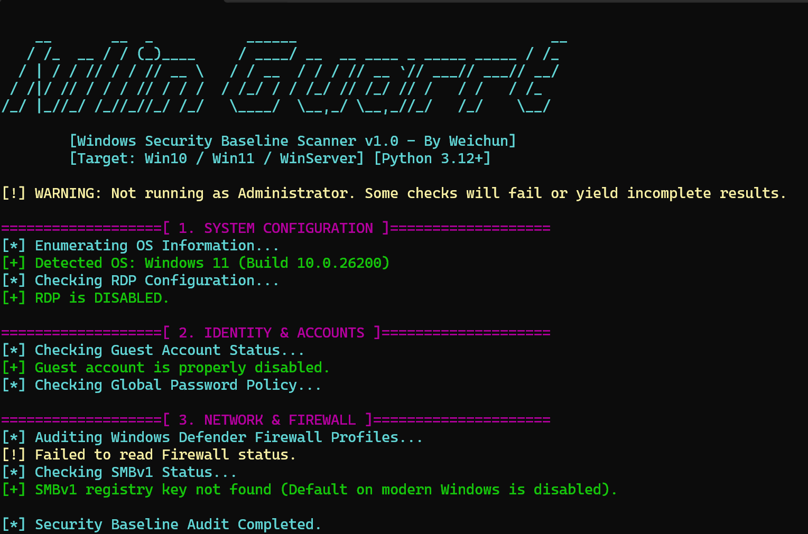

<div align="center">

# 🛡️ WinGuard Scanner

**高级 Windows 安全基线自动化审计矩阵 | Advanced Windows Security Baseline Audit**

[](#)
[](#)
[](#)
[](#)

> ⚡ **A lightweight, zero-dependency, highly modular security baseline scanner designed for Windows environments.** </div>

---

## 📸 Terminal Preview (终端运行实况)

<div align="center">
  
</div>

---

## ✨ Core Features (核心杀手锏)

WinGuard 采用纯原生 Python 构建，专为红蓝对抗排查、系统加固与日常运维安全自查设计：

* 🚀 **Zero Dependency (零依赖架构):** 摒弃臃肿的第三方库。克隆即用，完全依赖 Python 标准库与 Windows 原生命令 (`net`, `reg`, `netsh`)，在严苛的受限环境中依然稳健。
* 🧩 **Modular Design (高度模块化):** 检查逻辑被精心拆分为独立的审计模块。想增加新的检查项？只需在 `modules/` 下新建脚本，主程序会自动优雅地接入。
* 🎨 **Hacker Aesthetics (极客视觉引擎):** 独家定制的 ANSI 终端渲染引擎，在黑底终端下呈现极具视觉冲击力的高亮警报与通过提示，让枯燥的安全排查变成一种享受。
* ⚡ **Non-Intrusive (无侵入式只读):** 所有探测均为“只读”操作，绝不修改系统任何注册表或配置项，确保生产环境绝对安全。

---

## 🔍 Audit Matrix (全维审计矩阵)

当前版本覆盖三大核心安全域：

| 审计模块 (Module) | 探测深度 (Detection Scope) | 风险拦截 (Risk Intercepted) |
| :--- | :--- | :--- |
| **💻 System Config** | OS 构建版本枚举<br>RDP (3389) 注册表项状态审查 | 拦截未经授权的远程桌面暴露面 |
| **🎭 Identity & Auth** | 隐藏 Guest 账户活跃状态<br>全局系统密码最小长度策略 | 阻止弱口令爆破与影子账户潜伏 |
| **🌐 Network & Firewall** | Windows Defender 配置文件穿透<br>SMBv1 协议内核级状态审计 | 阻断 WannaCry 等利用高危协议的勒索蠕虫 |

---

## 🚀 Quick Start (闪电启动)

### ⚠️ 先决条件
为了确保脚本能够成功读取底层注册表和调用系统网络接口，**必须以管理员身份运行终端**。

### 1. 获取代码
```cmd
git clone [https://github.com/你的用户名/WinGuard.git](https://github.com/你的用户名/WinGuard.git)
cd WinGuard

2. 执行审计
右键点击开始菜单，选择 “终端(管理员)” 或 “命令提示符(管理员)”：
python run.py

Plaintext
WinGuard/
├── run.py                 # 🚀 战术指挥中心 (主启动程序)
├── requirements.txt       # 📦 依赖清单 (Empty, Zero-Dep!)
├── core/
│   └── ui.py              # 🎨 ANSI 终端视觉与日志高亮引擎
└── modules/               # 🔫 审计武器库
    ├── system_audit.py    # 底层配置探针
    ├── account_audit.py   # 认证与策略探针
    └── network_audit.py   # 网络防御探针